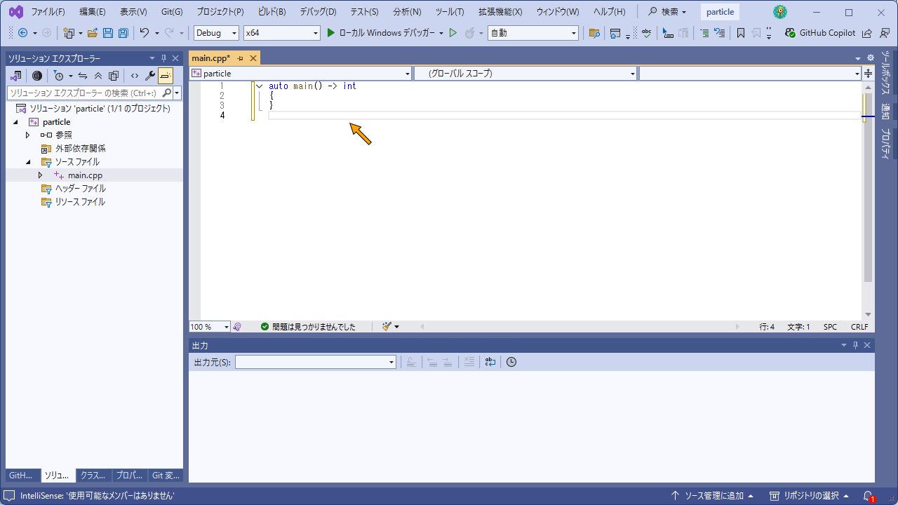

# particle

## 1. C++プロジェクトの新規作成

実験には何かの道具が必要になります。もし、それに使える既存のアプリケーションやサービス、あるいは、他の人が作ったプログラムやライブラリが存在すれば、それを使うに越したことはありません。しかし、実験の内容を満たす道具が無かったり、同じ目的の異なる手法を開発しようとするなら、ある程度道具は自分で作る必要があります。ここではプログラミングの練習も兼ねて、できるだけ何もないところから、目的のプログラムを作成することにします。

### 1.1 新しい C++ プロジェクトの作成

Visual Studio 2022 を起動して「新しいプロジェクトの作成(N)」を選びます。


「空のプロジェクト」を作成します。


### 1.2 main.cpp の追加

「プロジェクト」メニューから「新しい項目の追加(W)...」を選びます。


追加する項目のファイル名を指定します。ここでは main.cpp とします。


ソースプログラムを入力します。



ソースプログラムの内容は、次のようなものです。何もしないプログラムです。

```cpp
auto main() -> int
{
}
```

### 1.3 プログラムのビルドと実行

「▷ローカル Windows デバッガー」をクリックして、プログラムのビルドと実行を行います。


ビルドに成功するとプログラムが実行されて、次のようなコンソールウィンドウが現れます。このウィンドウ上で任意のキーをタイプするかクローズボックスをクリックして、ウィンドウを閉じます。


## [ステップ 01](https://github.com/tokoik/particle/tree/step01)
