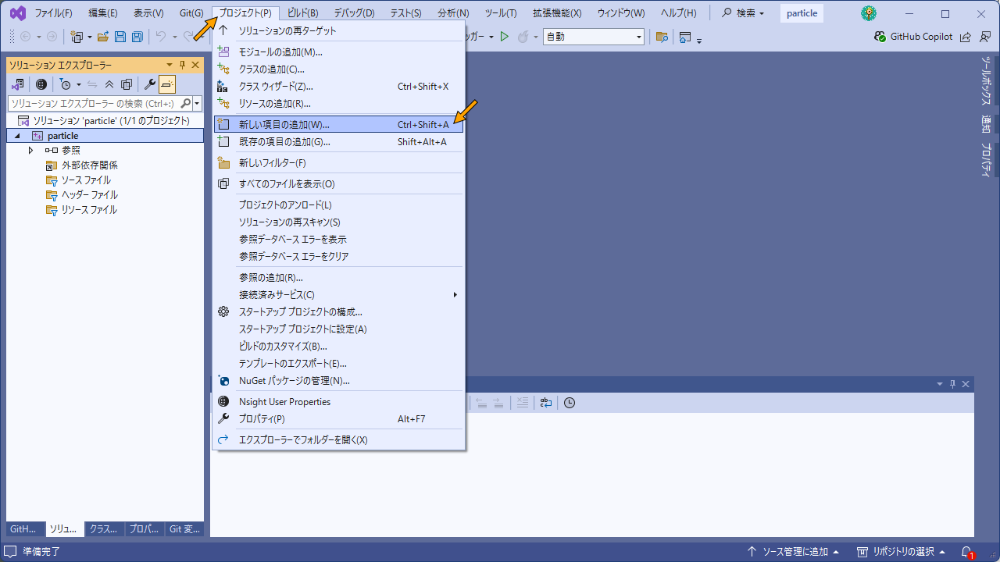
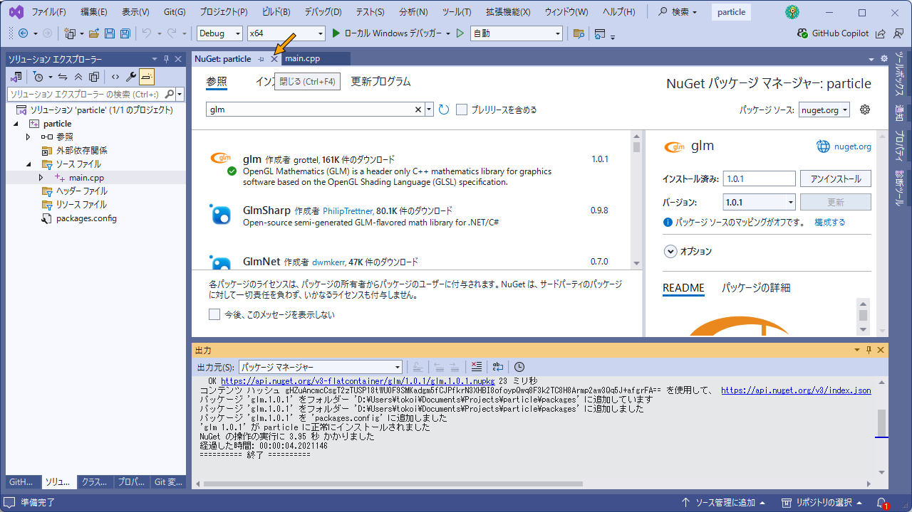

# particle

## 1. C++プロジェクトの新規作成

実験には何かの道具が必要になります。もし、それに使える既存のアプリケーションやサービス、あるいは、他の人が作ったプログラムやライブラリが存在すれば、それを使うに越したことはありません。しかし、実験の内容を満たす道具が無かったり、同じ目的の異なる手法を開発しようとするなら、ある程度道具は自分で作る必要があります。ここではプログラミングの練習も兼ねて、できるだけ何もないところから、目的のプログラムを作成することにします。

### 1.1 新しい C++ プロジェクトの作成

Visual Studio 2022 を起動して「新しいプロジェクトの作成(N)」を選びます。


「空のプロジェクト」を作成します。


### 1.2 main.cpp の追加

「プロジェクト」メニューから「新しい項目の追加(W)...」を選びます。



追加する項目のファイル名を指定します。ここでは main.cpp とします。


ソースプログラムを入力します。


ソースプログラムの内容は、次のようなものです。何もしないプログラムです。

```cpp
auto main() -> int
{
}
```

### 1.3 プログラムのビルドと実行

「▷ローカル Windows デバッガー」をクリックして、プログラムのビルドと実行を行います。


ビルドに成功するとプログラムが実行されて、次のようなコンソールウィンドウが現れます。このウィンドウ上で任意のキーをタイプするかクローズボックスをクリックして、ウィンドウを閉じます。


## [ステップ 01](https://github.com/tokoik/particle/tree/step01)

## 2. ライブラリの追加

OpenGL を使ったアプリケーションの作成を手助けするために、[GLFW](https://www.glfw.org/)、[GLEW](https://glew.sourceforge.net/)、[GLM](https://github.com/g-truc/glm) の3つのライブラリを作成したプロジェクトに追加します。これらは、それぞれの Web ページからソースファイルやコンパイル済みのバイナリファイルを入手することができますが、Visual Studio では [NuGet](https://www.nuget.org/) というパッケージマネージャを使って、作成したプロジェクトに組み込むことができます。

### 2.1 GLFW の追加

OpenGL はプラットフォームに依存しないグラフィックスライブラリですが、アプリケーションが OpenGL を使ってグラフィックス表示をしようとするときには、プラットフォームに依存した手順でお膳立てをしてやる必要があります。GLFW は、そのお膳立てをするためのレームワーク（ソフトウェア開発を手助けするための枠組み）です。これをインストールするために、まず「プロジェクト」メニューから「NuGetパッケージの管理(N)...」を選びます。


「参照」を選んで「glfw」を検索し、glfwのパッケージを選んで「インストール」をクリックします。


「適用」をクリックします。


### 2.2 GLEW の追加

同様にして、GLEW というライブラリをインストールします。これは Windows が標準ではサポートしていない OpenGL のバージョン 1.1 より後の機能を有効にします。「glew」を検索して最新版の2.2.0 を選び、「インストール」をクリックします。なお、前記の GLEW のプロジェクトのサイトでは最新版は 2.1.0 になっていますが、GitHub 上の最新版は 2.2.0 になっています (2025年5月23日時点)。


### 2.3 GLM の追加

最後に、GLM をインストールします。これは OpenGL を使ってプログラミングする際に便利なデータ型や数学関数を集めたものです。「glm」を検索し、glmのパッケージを選んで「インストール」をクリックします。


NuGet のタブはもう使わないので閉じて構いません。



## [ステップ 02](https://github.com/tokoik/particle/tree/step02)
